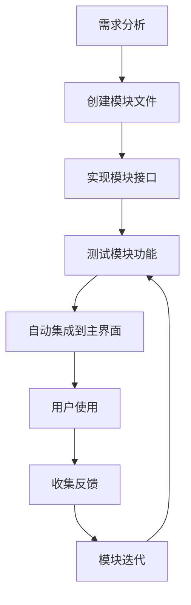

# SingleCellStudio 模块化架构解决方案

## 问题陈述

随着功能增加，`professional_main_window.py` 文件会变得越来越大，难以维护。需要一个解决方案，让新模块可以独立开发和集成，而不需要修改主窗口代码。

## 解决方案架构

### 1. 核心组件

```
src/gui/
├── modular_main_window.py          # 模块化主窗口
├── professional_main_window.py     # 原始专业版主窗口
├── modules/
│   ├── module_registry.py          # 模块注册系统
│   ├── example_module.py           # 示例模块
│   └── [new_modules]               # 新模块（自动发现）
└── default.qss                     # QSS样式文件
```

### 2. 关键设计模式

#### 模块注册器模式 (Module Registry Pattern)
- **`ModuleRegistry`**: 中央注册器管理所有模块
- **`BaseGUIModule`**: 抽象基类定义模块接口
- **自动发现**: 扫描`*_module.py`文件并自动注册

#### 插件架构 (Plugin Architecture)
- **动态加载**: 运行时发现和加载模块
- **松散耦合**: 模块间通过信号和标准接口通信
- **依赖检查**: 自动检查模块依赖并处理缺失

## 使用方法

### 启动模块化版本

```bash
# 方法1：使用专用启动器
python launch_modular.py

# 方法2：设置环境变量
export SINGLECELLSTUDIO_MODULAR=true
python singlecellstudio.py

# 方法3：直接运行
python src/gui/modular_main_window.py
```

### 创建新模块

1. **创建模块文件** (必须以`_module.py`结尾):

```python
# src/gui/modules/my_analysis_module.py

from .module_registry import BaseGUIModule
from PySide6.QtWidgets import QWidget, QVBoxLayout, QLabel

class MyAnalysisModule(BaseGUIModule):
    @property
    def module_name(self) -> str:
        return "my_analysis"
    
    @property 
    def display_name(self) -> str:
        return "我的分析"
    
    @property
    def description(self) -> str:
        return "自定义分析模块"
    
    def create_widget(self, parent=None):
        widget = QWidget(parent)
        layout = QVBoxLayout()
        layout.addWidget(QLabel("我的分析模块"))
        widget.setLayout(layout)
        return widget
```

2. **自动集成**: 重启应用程序，模块将自动出现在界面中

3. **无需修改主窗口代码** ✅

## 核心优势

### ✅ 解决的问题

1. **主窗口文件过大**: 模块化后主窗口保持简洁
2. **代码耦合**: 模块间松散耦合，独立开发
3. **维护困难**: 每个模块独立维护，不影响其他部分
4. **扩展困难**: 新功能通过模块轻松添加

### ✅ 架构优势

1. **独立开发**: 
   - 模块可以独立开发和测试
   - 不需要了解整个项目结构
   - 支持团队并行开发

2. **动态加载**:
   - 运行时自动发现新模块
   - 支持热插拔（重启后生效）
   - 依赖检查和错误处理

3. **标准化接口**:
   - 统一的模块接口 (`BaseGUIModule`)
   - 标准化的数据传递 (`set_data`)
   - 统一的信号通信机制

4. **易于扩展**:
   - 新模块只需继承基类
   - 自动集成到菜单和界面
   - 支持模块间通信

## 实际应用示例

### 模块类型

1. **分析模块**: 差异表达、富集分析、轨迹分析
2. **可视化模块**: 自定义图表、交互式图形
3. **数据处理模块**: 质控、标准化、批次效应
4. **导入导出模块**: 支持新的数据格式

### 开发工作流



## 技术细节

### 模块生命周期

1. **发现阶段**: 扫描`*_module.py`文件
2. **注册阶段**: 注册模块类到注册器
3. **实例化阶段**: 创建模块实例
4. **初始化阶段**: 调用`initialize()`方法
5. **集成阶段**: 添加到界面和菜单
6. **运行阶段**: 响应用户操作
7. **清理阶段**: 应用退出时清理资源

### 通信机制

```python
# 模块向主窗口发送信号
class MyModule(BaseGUIModule):
    analysis_completed = Signal(dict)
    
    def run_analysis(self):
        result = {"status": "complete"}
        self.analysis_completed.emit(result)

# 主窗口接收信号
def connect_module_signals(self, module):
    if hasattr(module, 'analysis_completed'):
        module.analysis_completed.connect(self.on_analysis_completed)
```

### 错误处理

- **依赖检查**: 自动检查并报告缺失的依赖
- **异常隔离**: 模块错误不影响主应用程序
- **降级运行**: 禁用有问题的模块，其他功能正常

## 对比分析

| 特性 | 原始架构 | 模块化架构 |
|------|----------|------------|
| 主窗口代码大小 | 随功能增长 ❌ | 保持稳定 ✅ |
| 添加新功能 | 修改主文件 ❌ | 独立模块文件 ✅ |
| 代码耦合度 | 高耦合 ❌ | 松散耦合 ✅ |
| 团队协作 | 冲突频繁 ❌ | 并行开发 ✅ |
| 测试难度 | 整体测试 ❌ | 模块独立测试 ✅ |
| 维护成本 | 随规模增加 ❌ | 模块化维护 ✅ |

## 迁移策略

### 现有模块迁移

1. **保持兼容**: 原有`professional_main_window.py`仍然可用
2. **逐步迁移**: 将现有功能逐步提取为独立模块
3. **平滑过渡**: 通过环境变量选择使用哪个版本

### 开发建议

1. **新功能**: 优先使用模块化架构开发
2. **重构**: 逐步将大型功能拆分为独立模块
3. **文档**: 为每个模块编写独立文档

## 总结

这个模块化架构解决方案完美解决了你提出的问题：

✅ **主要目标达成**:
- 主窗口文件不再随功能增长而变大
- 新模块可以独立开发，无需修改主窗口代码  
- 模块自动发现和集成
- 保持了代码的清晰和可维护性

✅ **额外收益**:
- 支持团队并行开发
- 模块可以独立测试和部署
- 错误隔离，提高稳定性
- 标准化的开发流程

这种架构让SingleCellStudio能够快速扩展新功能，同时保持代码的清晰和可维护性，是一个可扩展的长期解决方案。 